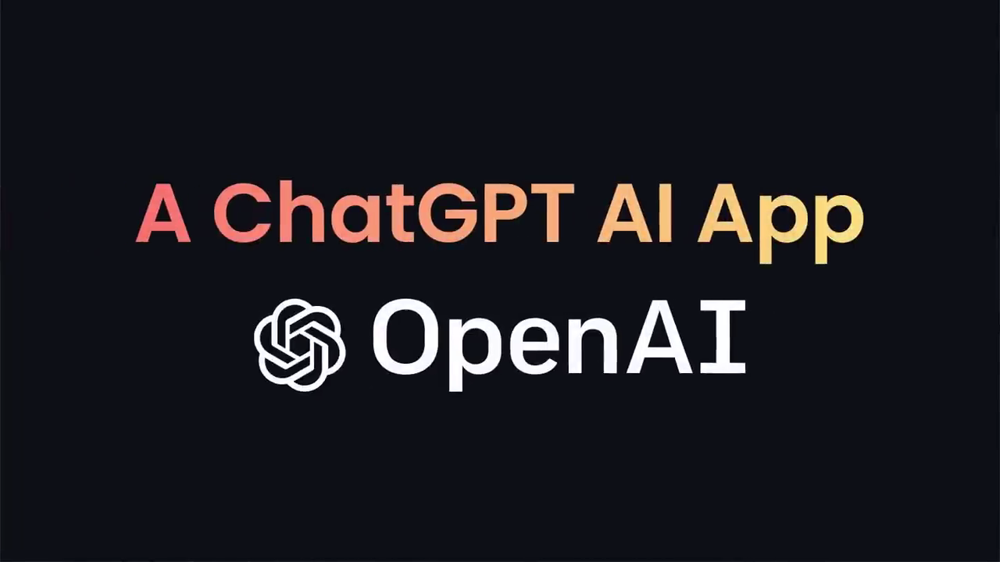
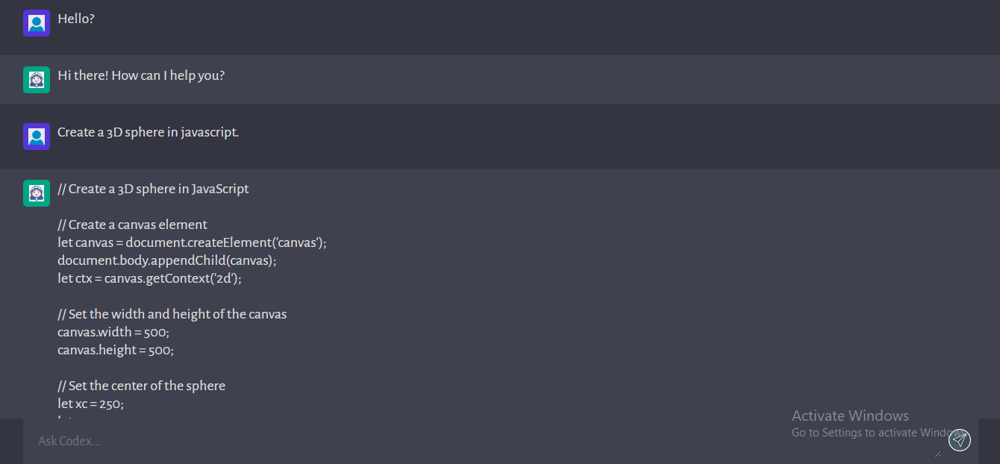
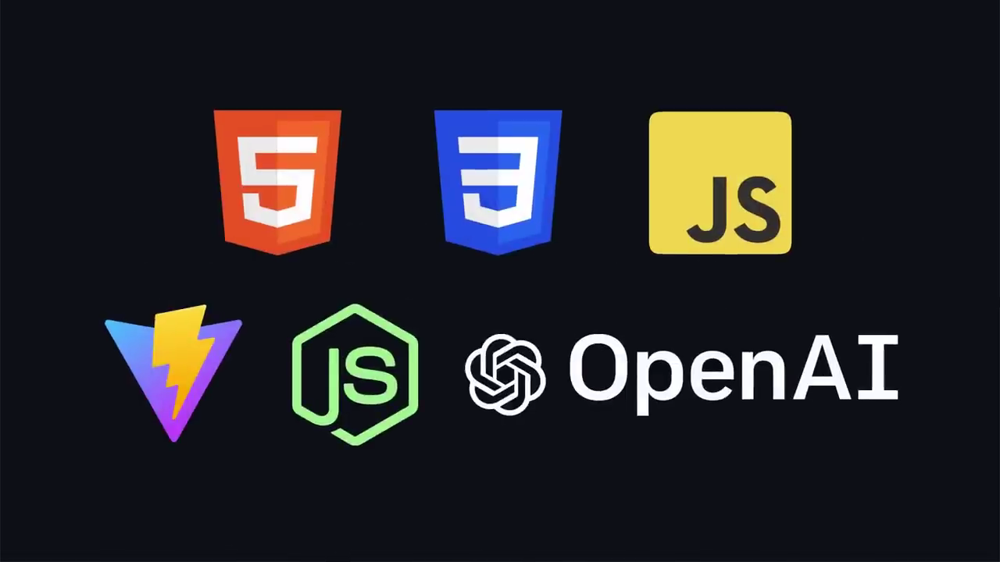

# ChatGPT-Client

> Chatbot Frontend Project.

<!-- > Live demo [_here_](https://www.example.com). -->

## Table of Contents

- [General Info](#general-information)
- [Technologies Used](#technologies-used)
- [Features](#features)
- [Screenshots](#screenshots)
- [Setup](#setup)
- [Usage](#usage)
- [Project Status](#project-status)
- [Room for Improvement](#room-for-improvement)
- [Acknowledgements](#acknowledgements)
- [Contact](#contact)

## General Information

- Elegant User Interface that resembles the ChatGPT App
- Communication with advanced GPT 3 model API
- Feel power of ChatGPT
- To study OpenAI

## Technologies Used

- Tech 1 - OpenAI
- Tech 2 - Vanilla
- Tech 3 - JavaScript

## Features

List the ready features here:

- Responsive layout with CSS
- Handle events with JavaScript
- Render markdown from string
- Prism for code highlight
- Make API requests
- Catch errors
- Write clean code & much more

## Screenshots

## Setup

Project uses Node.js for frontend.\
Use vite to create project. All you need to do is just run `npm install` to install node_modules & run `npm run dev`.

## Usage

You can use this for several chatbot frontend.
Just clone the project and use it as frontend.

## Project Status

Project is: _complete_.

## Room for Improvement

These are room for improvement and ToDos.

Room for improvement:

- OpenAI
- JavaScript

To do:

- Update UI
- Flexible Chat

## Acknowledgements

- This project was inspired by Valentyn.
- This project was based on [this tutorial](https://platform.openai.com/docs/introduction).
- Many thanks to Valentyn.

## Contact

Created by [@violetstar701](https://) - feel free to contact me!
